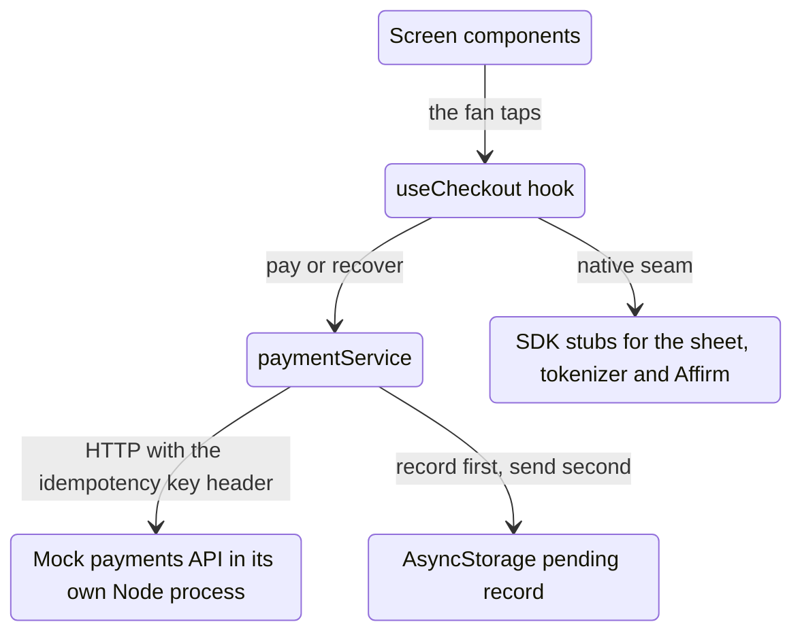
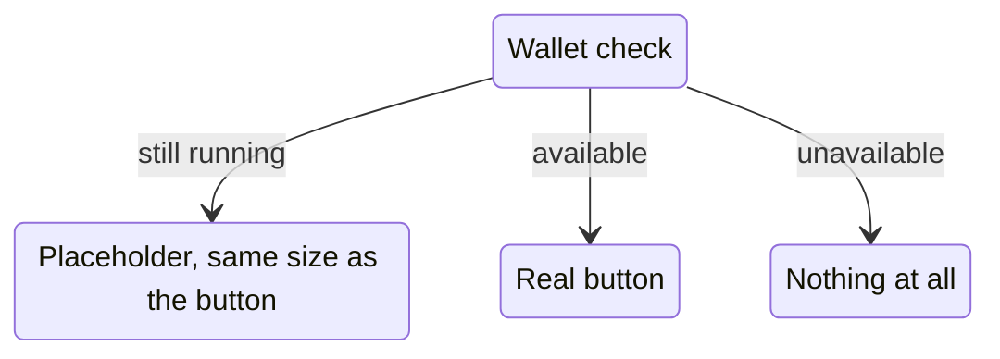
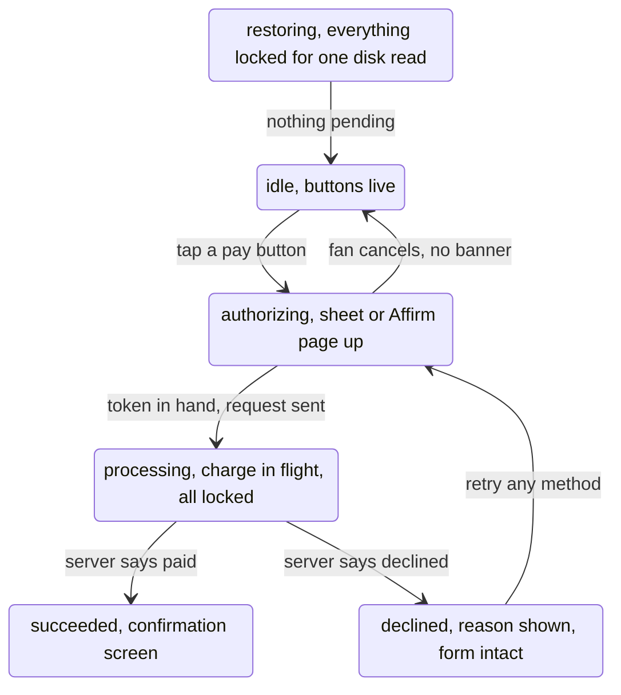
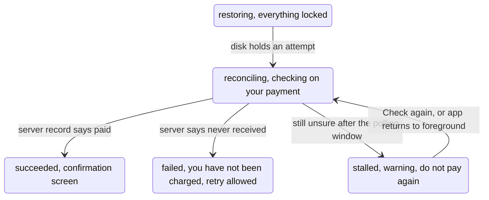
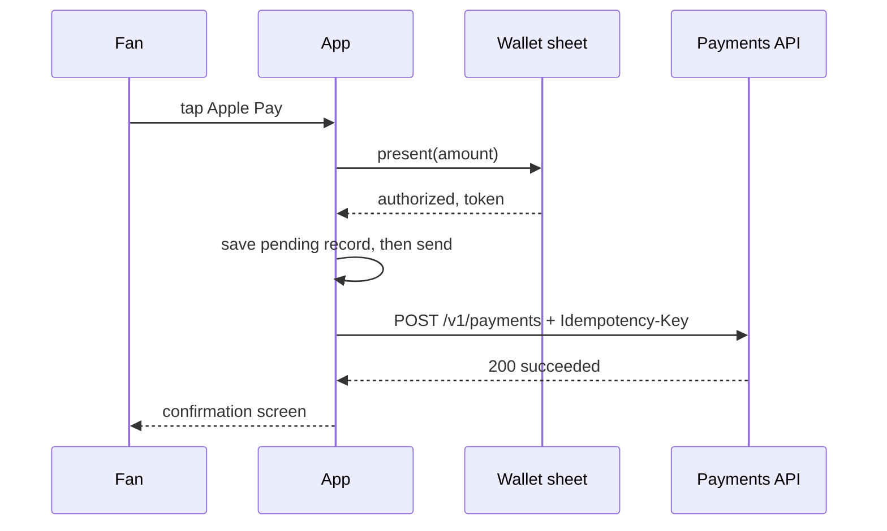
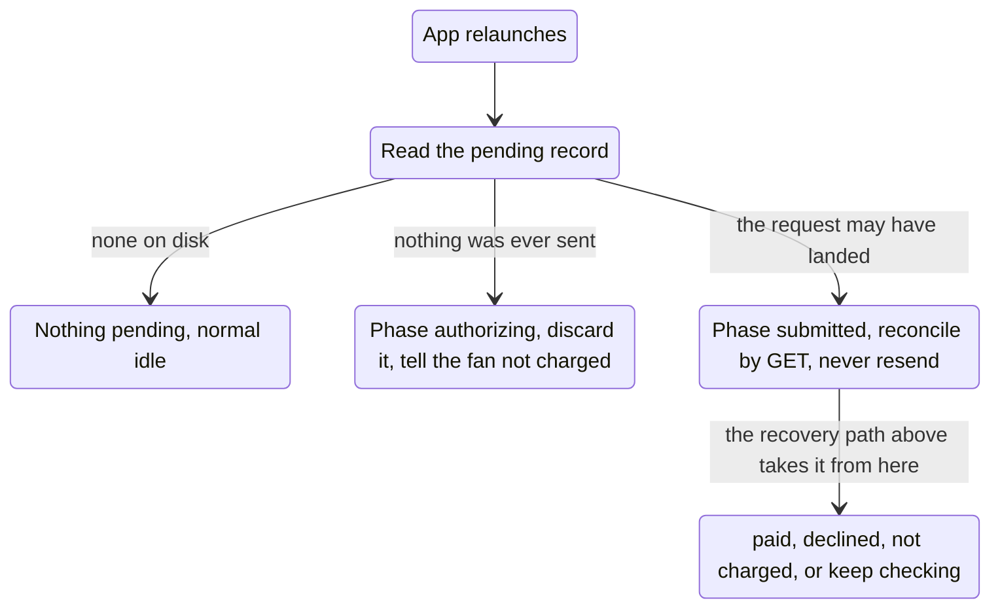

# System Design

A checkout screen for buying tickets. The fan already picked seats, and now they pay. Three things make this harder than a form with a button:

1. The set of payment methods is not fixed. It depends on the platform (iOS or Android), on what is set up on the device (a card in Wallet, Google Pay ready), and on the cart total (Affirm only over $100).
2. Express methods must finish the purchase in one interaction. Tap Apple Pay, confirm in the sheet, done. No second submit button.
3. Phones interrupt payments. Face ID pauses the app, Affirm bounces through a browser, and the fan can force-quit mid-charge. Coming back has to work, and nobody may ever be charged twice.

This document is the architecture map. The reasoning behind the API shape is in the [README](README.md), section 3, along with how to run everything.

## How the pieces fit

The main spine runs top to bottom: a tap in a component, the hook decides, the service pays, the server answers. The two branches are the seams: the hook talks to the stubbed native SDKs, and the service writes its crash-recovery record to disk before any request leaves the device. Not pictured: the thin typed HTTP client (`src/api/paymentsApi.ts`) the service speaks through, and the pure domain layer (eligibility, card validation, money), which everything above imports and which imports nothing from React, so the rules a reviewer cares about most are plain functions with plain unit tests. Dependency direction only flows down.

The mock API is a separate OS process on purpose. If it lived inside the app, killing the app would kill the "server" too, and the no-double-charge demo would prove nothing. A separate process keeps the charge record alive across an app kill, exactly like a real backend.

## Showing the right payment methods

| Method | Shown when |
|---|---|
| Apple Pay | iOS, and the device reports a provisioned card in Wallet |
| Google Pay | Android, and the device reports Google Pay is set up |
| Affirm | Cart total strictly over $100.00 (exactly $100.00 does not qualify) |
| Card | Always. This is the fallback for everyone |

The wallet checks are async, so a boolean is not enough. While a check is running the only true answer is "we do not know yet":

A placeholder means no button ever pops in late and no button appears that might not work. Money is integer cents throughout, because float arithmetic could land a total at 100.0000001 dollars and wrongly unlock Affirm. Eligibility is a pure function of platform, capabilities and total, recomputed on every render, so changing the ticket quantity moves Affirm in or out of the list on the same frame.

A dev menu (only compiled in dev builds) can force platform, wallet state and total, so a reviewer can walk every eligibility case on one simulator. With everything on Auto, the real detection path runs.

## Checkout states

The complete machine, with every guard, is one pure reducer in `src/checkout/checkoutMachine.ts`. Rather than one diagram with every arrow, here are the two paths a fan actually travels through it.

The purchase. Every launch passes through a moment of `restoring` while the pending record is read from disk; on a clean launch it lasts one read and is invisible. Cancelling the sheet walks quietly back; a decline allows a retry with any method.

The recovery. Entered from a timeout or 5xx mid-purchase, or straight from launch when the disk holds an unfinished attempt. Recovery only ever asks the server by GET; it never re-sends a charge.

A reconcile that finds a declined record lands on the declined banner, same as the purchase path. The stalled box is not a separate state in code: it is `reconciling` with a flag, so the warning can never disagree with the fact that checking continues.

What the fan sees in each state:

| State | On screen |
|---|---|
| restoring | Everything locked for one disk read. Invisible on a clean launch; exists so a fast tap cannot start a payment before the app knows whether one is already in flight |
| idle | Order summary, payment buttons, card form |
| authorizing | The wallet sheet, the Affirm page, or "Securing your card" |
| processing | "Processing your payment" overlay, everything locked |
| reconciling | "Checking on your payment", and after repeated unknowns a warning: do not pay again, plus a Check again button |
| succeeded | Confirmation with amount, method and payment id |
| declined | The decline reason, form intact, retry allowed |
| failed | "You have not been charged", retry allowed |

The machine is a reducer: a pure function of (state, event). Events that make no sense in the current state return the same state object, which is how a double tap on Pay becomes a no-op instead of a second charge.

## Express means one interaction

The sheet result flows straight into the charge. Affirm follows the same shape, with the sheet replaced by a browser redirect that deep-links back into the app. Cancelling the sheet or closing the browser is a choice, not an error: the screen returns to idle with no red banner.

## Surviving backgrounding and force-quit

Backgrounding is the easy case: nothing is reset on an AppState change, so the in-flight work resumes when the app returns. Force-quit is the real problem, and the answer is a write-ahead record with two phases:

The record is saved to disk before the request leaves the device. If the phone dies one millisecond after the POST was sent, the relaunched app finds the `submitted` record and asks the server what happened. It never re-sends, so recovery can never create a charge.

## Never charging twice

Two independent defences on the server:

1. Every purchase attempt carries a client-generated Idempotency-Key. If the server has seen the key, it replays the stored result instead of charging again. This is the same mechanism Stripe uses.
2. One order can hold only one non-declined payment, whatever the key. A brand-new key against an already-paid order gets a 409 that carries the winning payment record, so the app shows that payment's confirmation instead of stranding the fan on an error.

The client never sends card numbers. Card data is exchanged for an opaque token by a tokenizer stub, mirroring how real payment SDKs keep merchant servers out of PCI scope.

## The API at a glance

| Endpoint | Purpose | Responses |
|---|---|---|
| POST /v1/payments (Idempotency-Key header) | Charge | 200 paid, 402 declined with declineCode, 400, 409 key reused with a different body or order already paid (that 409 includes the winning payment record), 422 rule violation, 500 |
| GET /v1/payments/:key | What happened to my attempt | 200 record, 404 never received |
| POST /v1/affirm/checkouts | Start an Affirm session | 201 with redirectUrl, 400, 422 if not over $100 |
| GET /mock-affirm/:id | Stand-in for Affirm's hosted page | HTML with confirm and cancel links |
| GET /v1/_debug/payments | Reviewer aid, list all charges | JSON |

Why the contract is shaped this way is covered in the README, section 3.
